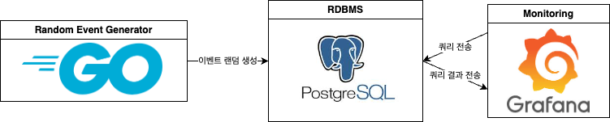
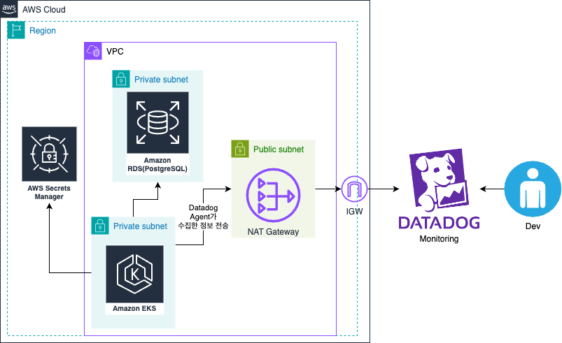
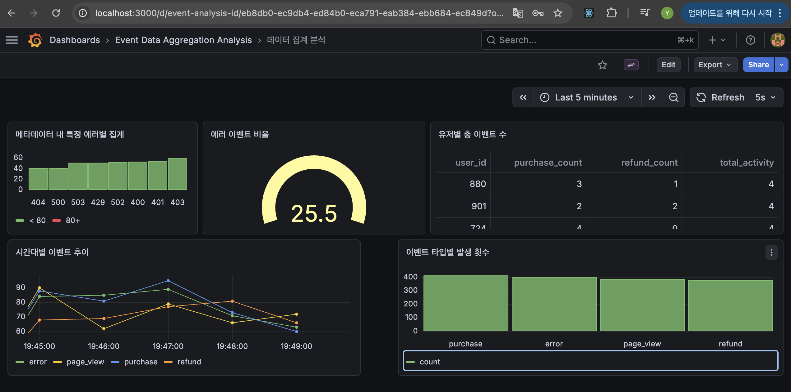

# 이벤트 로그 데이터 수집 및 시각화 파이프라인

웹 서비스에서 발생하는 유저의 행동을 Event라는 도메인으로 정의하고 이를 기록하고 쿼리를 통해 분석하는 파이프라인을 설계합니다.

## 과제 수행 여부

필수 과제, 선택 과제 1, 2 모두 완료

## 실행 방법

실행은 pipeline 루트 디렉토리를 기준으로 합니다.

실행 방법은 두 가지가 존재합니다.

- **Docker Compose 기반 실행:**
  ```bash
  docker compose up -d --build
  ```
  --build 옵션을 사용하여 필요한 이미지들을 빌드합니다.
  PostgreSQL DB, Event-Generator 인스턴스, Grafana가 컨테이너 환경에서 즉시 실행됩니다.

  localhost:3000을 통해서 Grafana에 접속 가능합니다.

  **ID**: admin, **PW**: 1234

  접속 후에, 왼쪽 메뉴를 클릭하여 Connections -> Data Sources에서 PostgreSQL을 클릭한 뒤, 맨 아래의 Save&Test를 클릭하여 연결을 확인합니다.

이후 Dashboards에 들어가서 Event Data Aggregation Analysis -> 데이터 집계 분석 대시보드에 들어가면 패널들을 확인할 수 있습니다.

- **로컬 Kubernetes 환경 (KinD) 실행:**
  ```bash
  sh k8s/init_kind.sh
  ```
  KinD 클러스터를 생성하고 `event-system` 네임스페이스에 각 서비스들(Event-Generator, Postgres, Grafana)의 메니페스트를 배포합니다.
  실행 과정 중 Grafana 서버(포트 3000)를 포트포워딩할지 묻는 프롬프트가 나타납니다.

## 아키텍처


로컬 환경(Docker / KinD)에서 구동되는 데이터 파이프라인으로 구성되어 있으며, 이벤트 로그 생성부터 시각화까지의 과정을 자동화합니다.

### AWS 아키텍처 설계


- **EKS (Elastic Kubernetes Service)**: 실제 AWS를 사용하여 배포하게 된다면 EKS를 사용하여 Manifest와 이미지를 빌드하여 배포하여 클라우드에서 컨테이너 오케스트레이션을 위해 선택하였습니다. 이벤트 로그를 수집하고 저장하는 비즈니스 로직을 수행할 파드와 이를 모니터링할 Datadog에 보낼 Datadog Agent 파드가 배포됩니다.

- **RDS (PostgreSQL)**: 클라우드 환경에서 직접적인 운영에 대한 부담을 줄이고 안정적인 데이터베이스를 사용하기 위해서 선택하였습니다.

- **AWS Secret Manager**: 각종 비밀번호나 중요한 인가 정보 등을 안전하게 관리하기 위해서 채택하였습니다.

- **Datadog**: 클라우드 기반의 모니터링을 위해서 채택하였습니다. 도메인이나 로그뿐만 아니라, 향후 인프라 전반에 대한 모니터링 작업의 확장을 위해서 선택하였습니다.

설계할 때 있어서 가장 고민했던 부분은 결국 메타데이터의 처리와 관련된 부분이었던 것 같습니다. 단순 정형 데이터라면 RDS를 사용하면 되지만, JSONB타입이기에, NoSQL을 사용해야하는지 고민했지만, PostgreSQL 자체가 GIN인덱스를 통해 JSONB타입을 효율적으로 처리한다는 점을 고려할 때, 오버엔지니어링이라고 생각되어 RDS만을 선택하게 되었습니다.

## 스키마

구입과 관련한 이벤트를 분석하기 위해서 다음과 같은 스키마를 설계하였습니다.

PostgreSQL에 저장되는 `Event` 로그 데이터의 스키마입니다. (GORM 사용)
- `event_id` (String): 이벤트 고유 ID (Primary Key)
- `user_id` (Int): 이벤트를 발생시킨 유저 고유 번호
- `event_type` (String): 이벤트 종류 (`page_view`, `purchase`, `refund`, `error` 등)
- `created_at` (Timestamp): 이벤트 발생 시각
- `metadata` (JSONB): 이벤트 특성별 상세 데이터 (동적 스키마)가 저장되는 필드

이벤트를 구분할 event_id, 이벤트의 주인을 구분할 user_id, 이벤트 발생 시각을 나타내는 created_at을 설정하였습니다.

event_type은 구입이라는 비즈니스 영역에 맞춰서 기본적으로 조회, 구입, 환불, 에러로 정의하였습니다.

metadata는 각 이벤트 발생 시 특별히 참고해야할 사항이나, 정형화되지 않은 데이터, 에러 메시지 등을 담기 위한 목적으로 정의하였습니다.

## 구현

### 이벤트 생성기
- **Go 언어** 기반 로직 (Gin + GORM 모듈 사용)

- Go는 가볍고 매우 빠르며 쉬운 병렬 처리 기능인 GoRoutine을 지원하여, 이벤트 생성에 적합한 언어라고 판단하여 선택하였습니다.

- 환경변수 `TICKER_SECONDS`에 설정된 주기 단위로 백그라운드 고루틴(`goroutine`)을 활용하여 랜덤 이벤트(1~10건/주기)를 생성합니다.

- 생성된 이벤트 데이터는 연결된 PostgreSQL DB로 즉시 저장되며 로그를 남깁니다.

- `/health` 엔드포인트를 열어 DB 연결 상태(Ping) 기반의 헬스체크 프로세스를 제공합니다.

## Grafana 시각화 서버 구축 및 쿼리를 사용한 데이터 집계 분석
- Grafana 컨테이너 기동 시 파일 기반 프로비저닝(`grafana/provisioning`)을 통해 PostgreSQL DataSource 및 기본 대시보드가 자동 등록됩니다.

### 분석 시각화

- 이벤트 발생 추이와 에러 발생 등의 중요 지표를 시각화합니다.

- **"Event Data Aggregation Analysis"** 대시보드를 구축해 실시간 이벤트 로그 통계를 모니터링합니다.

### 쿼리
```sql
-- 메타데이터 내 특정 에러별 집계
SELECT 
  metadata->>'code' as ErrorResponse,
  CASE 
    WHEN (metadata->>'code')::int BETWEEN 400 AND 499 THEN '4xx'
    WHEN (metadata->>'code')::int BETWEEN 500 AND 599 THEN '5xx'
    ELSE 'Etc'
  END as ErrorType,
  count(*) as Count
FROM events
WHERE event_type = 'error' AND $__timeFilter(created_at)
GROUP BY 1, 2
ORDER BY Count;
```
- 이벤트에서 발생한 에러들 중에서 'code' 필드를 통해서 에러의 종류를 확인하고, 어떤 에러가 가장 많이 발생했는지 정렬합니다.

```sql
-- 전체 이벤트 중 에러 이벤트 비율
SELECT 
  (COUNT(*) FILTER (WHERE event_type = 'error')::float / 
   NULLIF(COUNT(*), 0)::float) * 100 as error_rate
FROM events
WHERE $__timeFilter(created_at);
```
- 전체 이벤트 중에서 에러가 차지하는 이벤트의 비율을 확인합니다.

```sql
-- 유저별 구매, 환불, 총 이벤트 수
SELECT 
  user_id, 
  COUNT(*) FILTER (WHERE event_type = 'purchase') as purchase_count,
  COUNT(*) FILTER (WHERE event_type = 'refund') as refund_count,
  COUNT(*) FILTER (WHERE event_type IN ('purchase', 'refund')) as total_activity
FROM events
WHERE $__timeFilter(created_at)
GROUP BY user_id
ORDER BY total_activity DESC
LIMIT 15;
```
- 유저별로 구매, 환불, 총 이벤트 수를 조회합니다. 가장 이벤트를 많이 발생시킨 활발한 유저를 상위 15명까지 정렬합니다.

```sql
--- 시간대별 각 이벤트 발생 추이
SELECT 
 $__timeGroupAlias(created_at, $__interval), 
 event_type AS metric, 
 count(*) AS count 
 FROM events 
 WHERE 
 $__timeFilter(created_at) AND 
 event_type IN ('page_view', 'purchase', 'refund', 'error') 
 GROUP BY 1, 2 
 ORDER BY 1;
```
- 시간의 흐름에 따라 각 이벤트들의 발생 추이와 흐름을 확인합니다.

```sql
-- 이벤트 타입별 발생 횟수
SELECT 
  event_type, 
  count(*) as count
FROM events
WHERE $__timeFilter(created_at)
GROUP BY event_type
ORDER BY count DESC;
```
- 전체 이벤트 중에서 각 이벤트 타입별 발생 횟수를 조회합니다. 

## Kubernetes
- **Namespace**: 클러스터의 네임스페이스를 초기화하기 위해서 작성하였습니다.

- **StatefulSet & PVC**: `PostgreSQL`은 데이터를 저장하고 관리하기 때문에, 상태를 저장해야하고 고정된 볼륨이 필요하므로 Deployment가 아닌 StatefulSet과 PVC를 사용했습니다.

- **Deployment**: `event-generator`, `grafana`는 상태를 저장하지 않고, 유연한 복제와 Replica 관리가 필요하므로 Deployment를 사용했습니다.

- **Service**: 각 파드들의 초기화 및 네트워크 연결을 위한 포트 설정을 위해서 작성하였습니다.

- **ConfigMap: Grafana**: 프로비저닝 파일들(dashboard.yaml, datasource, dashborad.json)들을 관리하기 위해서 선택하였습니다. 

- **Secret**: `Grafana`와 `Postgres` 비밀번호 등 민감한 정보를 관리하기 위해서 선택하였습니다.

## 회고
- 처음에 프로젝트를 시작하기 전에, 기술 스택을 선택함에 있어서 많은 고민이 있었습니다. `Spring`과 `Go` 중에서 어떤 스택을 활용할지 고민했었는데, `Spring`의 경우 안정적이고 생태계가 잘 갖춰져있지만, `Go`의 경우에는 일일이 모든 것들을 작성해야 하는 번거로움이 있었지만, `Spring` 대비 압도적인 성능과 이미지 빌드 시 용량 차이가 크고, 결국 `Kubernetes` 인프라 환경을 고려할 때, `Go`가 더 적합하다고 판단하여 선택하게 되었습니다.

- 쿼리를 작성할 때 있어서도 고민을 하게 되었는데, 결국 이러한 이벤트 로그를 보는 것은 개발자의 영역이라고 판단하여서 에러와 관련된 부분의 쿼리를 넣게 되었습니다. 또한 비즈니스적인 부분도 고민을 해서, 어떤 유저가 가장 활발하게 사용하는지(총 이벤트 수), 그리고 그러한 활발함이 실제 행동(구매, 환불)로 이어지는지, 그리고 구매와 환불의 상관관계 등을 확인하기 위한 쿼리를 작성했던 것 같습니다.